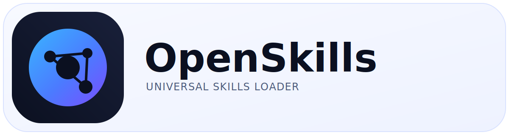

<div align="center">



<br/>
<br/>

**Universal skills loader for AI coding agents**

One CLI. Every agent. Same format as Claude Code.

[](https://www.npmjs.com/package/openskills)
[](https://www.npmjs.com/package/openskills)
[](https://opensource.org/licenses/Apache-2.0)

[Quick Start](#-quick-start) · [How It Works](#-how-it-works) · [Commands](#-commands) · [Create Skills](#-creating-your-own-skills) · [FAQ](#-faq)

</div>

---

## ✨ What Is OpenSkills?

OpenSkills brings **Anthropic's skills system** to every AI coding agent — Claude Code, Cursor, Windsurf, Aider, Codex, and anything that can read `AGENTS.md`.

**Think of it as the universal installer for SKILL.md.**

---

## 🚀 Quick Start

```bash
npx openskills install anthropics/skills
npx openskills sync
```

By default, installs are project-local (`./.claude/skills`, or `./.agent/skills` with `--universal`). Use `--global` for `~/.claude/skills`.

---

## ✅ Why OpenSkills

- **Exact Claude Code compatibility** — same prompt format, same marketplace, same folder structure
- **Universal** — works with Claude Code, Cursor, Windsurf, Aider, Codex, and more
- **Progressive disclosure** — load skills only when needed (keeps context clean)
- **Repo-friendly** — skills live in your project and can be versioned
- **Private friendly** — install from local paths or private git repos

---

## 🧠 How It Works

### Claude Code System Prompt (Skills)

Claude Code ships skills as **SKILL.md files** and exposes them inside a `<available_skills>` block. When the user asks for a task, Claude dynamically loads the matching skill.

```xml
<available_skills>
<skill>
<name>pdf</name>
<description>Comprehensive PDF manipulation toolkit for extracting text and tables...</description>
<location>plugin</location>
</skill>
</available_skills>
```

### OpenSkills: Same Format, Universal Loader

OpenSkills generates the **exact same `<available_skills>` XML** in your `AGENTS.md` and loads skills via:

```bash
npx openskills read <skill-name>
```

So any agent that can read `AGENTS.md` can use Claude Code skills without needing Claude Code itself.

### Side-by-Side

| Aspect | Claude Code | OpenSkills |
|--------|-------------|------------|
| **Prompt Format** | `<available_skills>` XML | Same XML | 
| **Skill Storage** | `.claude/skills/` | `.claude/skills/` (default) | 
| **Invocation** | `Skill("name")` tool | `npx openskills read <name>` | 
| **Marketplace** | Anthropic marketplace | GitHub (anthropics/skills) | 
| **Progressive Disclosure** | ✅ | ✅ |

<details>
<summary><strong>Show the exact AGENTS.md format OpenSkills writes</strong></summary>

```xml
<skills_system priority="1">

## Available Skills

<!-- SKILLS_TABLE_START -->
<usage>
When users ask you to perform tasks, check if any of the available skills below can help complete the task more effectively.

How to use skills:
- Invoke: `npx openskills read <skill-name>` (run in your shell)
- The skill content will load with detailed instructions
- Base directory provided in output for resolving bundled resources

Usage notes:
- Only use skills listed in <available_skills> below
- Do not invoke a skill that is already loaded in your context
</usage>

<available_skills>

<skill>
<name>pdf</name>
<description>Comprehensive PDF manipulation toolkit for extracting text and tables, creating new PDFs, merging/splitting documents, and handling forms...</description>
<location>project</location>
</skill>

</available_skills>
<!-- SKILLS_TABLE_END -->

</skills_system>
```

</details>

---

## 🔧 Install Skills

### From Anthropic Marketplace

```bash
npx openskills install anthropics/skills
```

### From Any GitHub Repo

```bash
npx openskills install your-org/your-skills
```

### From a Local Path

```bash
npx openskills install ./local-skills/my-skill
```

### From Private Git Repos

```bash
npx openskills install git@github.com:your-org/private-skills.git
```

---

## 🌍 Universal Mode (Multi-Agent Setups)

If you use Claude Code **and** other agents with one `AGENTS.md`, install to `.agent/skills/` to avoid conflicts with Claude's plugin marketplace:

```bash
npx openskills install anthropics/skills --universal
```

**Priority order (highest wins):**
1. `./.agent/skills/`
2. `~/.agent/skills/`
3. `./.claude/skills/`
4. `~/.claude/skills/`

---

## 🧰 Commands

```bash
npx openskills install <source> [options]  # Install from GitHub, local path, or private repo
npx openskills sync [-y] [-o <path>]       # Update AGENTS.md (or custom output)
npx openskills list                        # Show installed skills
npx openskills read <name>                 # Load skill (for agents)
npx openskills update [name...]            # Update installed skills (default: all)
npx openskills manage                      # Remove skills (interactive)
npx openskills remove <name>               # Remove specific skill
```

### Flags

- `--global` — Install globally to `~/.claude/skills` (default: project install)
- `--universal` — Install to `.agent/skills/` instead of `.claude/skills/`
- `-y, --yes` — Skip prompts (useful for CI)
- `-o, --output <path>` — Output file for sync (default: `AGENTS.md`)

---

## 🧬 The SKILL.md Format

OpenSkills uses Anthropic's exact format:

```markdown
---
name: pdf
description: Comprehensive PDF manipulation toolkit for extracting text and tables, creating new PDFs, merging/splitting documents, and handling forms.
---

# PDF Skill Instructions

When the user asks you to work with PDFs, follow these steps:
1. Install dependencies: `pip install pypdf2`
2. Extract text using scripts/extract_text.py
3. Use references/api-docs.md for details
```

Skills are **loaded on demand**, keeping your agent's context clean and focused.

---

## 🧪 Creating Your Own Skills

### Minimal Structure

```
my-skill/
└── SKILL.md
```

### With Resources

```
my-skill/
├── SKILL.md
├── references/
├── scripts/
└── assets/
```

Install your own skill:

```bash
npx openskills install ./my-skill
```

### Local Development with Symlinks

```bash
git clone git@github.com:your-org/my-skills.git ~/dev/my-skills
mkdir -p .claude/skills
ln -s ~/dev/my-skills/my-skill .claude/skills/my-skill
```

### Authoring Guide

```bash
npx openskills install anthropics/skills
npx openskills read skill-creator
```

---

## 🔄 Updating Skills

If you installed skills from a git repo, you can refresh them anytime:

```bash
npx openskills update
```

To update specific skills, pass a comma-separated list:

```bash
npx openskills update git-workflow,check-branch-first
```

If a skill was installed before updates were tracked, re-install it once to record its source.

---

## ✅ Tips

- You can always run OpenSkills via `npx`; a global install is optional.
- For multiple reads, prefer comma-separated names: `npx openskills read foo,bar`.

---

## ❓ FAQ

### Why CLI instead of MCP?

**MCP is for dynamic tools.** Skills are static instructions + resources.

- Skills are just files → no server required
- Works with every agent → no MCP support needed
- Matches Anthropic's design → SKILL.md is the spec

MCP and skills solve different problems. OpenSkills keeps skills lightweight and universal.

---

## 📋 Requirements

- **Node.js** 20.6+
- **Git** (for cloning repositories)

---

## 📜 License

Apache 2.0

## Attribution

Implements [Anthropic's Agent Skills](https://www.anthropic.com/engineering/equipping-agents-for-the-real-world-with-agent-skills) specification.

**Not affiliated with Anthropic.** Claude, Claude Code, and Agent Skills are trademarks of Anthropic, PBC.
